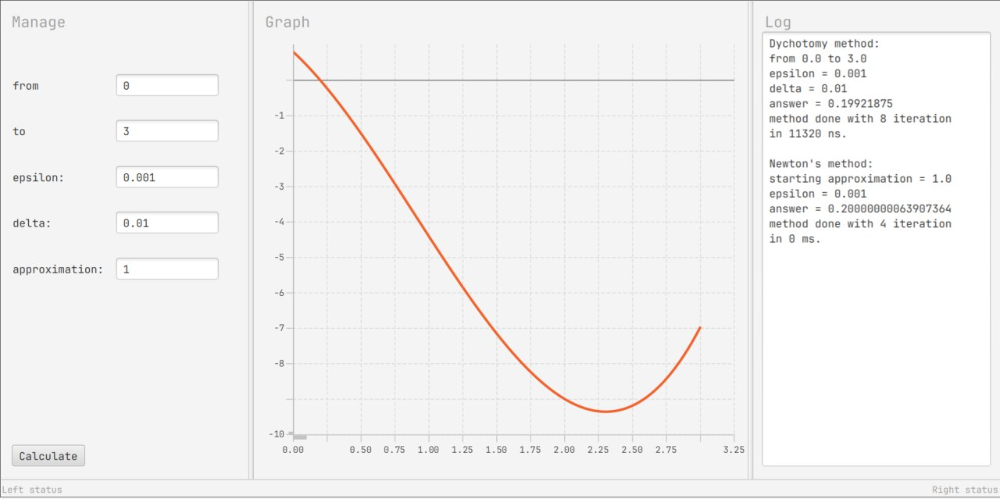

# Numerical root finding algorithms
Root-finding algorithms implementation.
Contains [Newton's method](https://en.wikipedia.org/wiki/Newton%27s_method) and [dichotomy method](https://en.wikipedia.org/wiki/Bisection_method#The_method) implementation.
Calculates zero of function $(x^3 - 2.7x^2 - 3.5x + 0.8)$.

Run with ```mvn javafx:run```.

Application have JavaFX GUI where user can specify:
* range for root searching
* epsilon - minimal segment length after which program return result if searching. Used for both Newton's and dichotomy methods.
* delta - minimal value after which program return result if searching. Used for dichotomy method.
* approximation - starting approximation point. Used for Newton's method.

